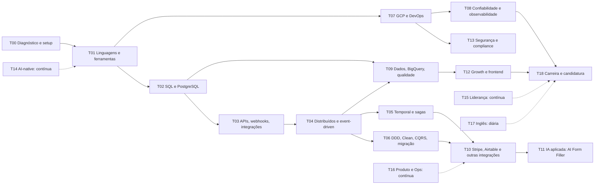

<!-- Arquivo gerado por scripts/gerar.py — edite scripts/plano/templates/A-mapa-de-trilhas.md. -->

# A) Mapa de tópicos em trilhas

Todos os tópicos das seções 3 e 4 foram agrupados em 19 trilhas de estudo, ordenadas por dependência
(fundamentos antes de padrões avançados). Cada tópico aponta para a sua trilha na [matriz de cobertura](matriz-de-cobertura.md).

## Ordem de dependência

As trilhas T14 (AI-native), T15 (liderança), T16 (produto/Ops) e T17 (inglês) correm em paralelo durante as 24 semanas.

## Trilhas

| Trilha | Objetivo | Nível-alvo | Prioridade | Depende de | Horas | Semanas com foco (≥3 h) | Se atrasar, pule |
|---|---|---|---|---|---|---|---|
| **T00** Diagnóstico e setup | Medir o nível real em cada grupo de tópicos e montar o ambiente (GCP com alertas de custo, repositório, ferramentas). | — | Essencial | — | 18 | 1 | Nada: é o que calibra o resto. Se faltar tempo, adie D16 (Growth) para a semana 2. |
| **T01** Linguagens e ferramentas (Go, Python, TypeScript, Git/GitHub) | Escrever Go e Python idiomáticos para serviços de produção; TypeScript suficiente para Next.js e clientes tipados; fluxo Git/GitHub profissional. | Go e Python: intermediário-avançado; TypeScript: intermediário; Git/GitHub: avançado | Essencial (TypeScript: recomendado) | T00 | 30 | 2, 3, 4, 6, 23, 24 | Capítulos avançados de Learn Go with Tests (reflection, generics avançado); GitHub Skills além de review/merge conflicts. |
| **T02** Bancos de dados, SQL e modelagem (PostgreSQL) | Modelar dados transacionais, dominar transações/isolamento/locks, índices e EXPLAIN, migrações seguras. | Intermediário-avançado | Essencial | T01 | 15,5 | 3, 4, 6 | CTEs recursivas e exercícios avançados do pgexercises; leitura completa do Use The Index, Luke (fique nos capítulos de B-tree e WHERE). |
| **T03** APIs, webhooks e integrações (HTTP, idempotência, retries, rate limits) | Construir APIs e consumidores de APIs/webhooks que toleram duplicatas, timeouts, 429 e quedas de terceiros. | Avançado | Essencial | T01, T02 | 15,5 | 4, 6 | Circuit breaker próprio (use biblioteca) e a versão Python completa do kit (faça só o cliente com retries). |
| **T04** Sistemas distribuídos e arquitetura event-driven (Pub/Sub, outbox) | Entender garantias de entrega, ordenação e consistência; implementar outbox, consumidores idempotentes e DLQ. | Intermediário-avançado | Essencial | T02, T03 | 15,5 | 8 | Capítulos de DDIA sobre consenso/replicação (leia transações, codificação e streams primeiro). |
| **T05** Orquestração de workflows (Temporal, sagas) | Modelar processos de longa duração com Temporal: sinais, timers, retries, sagas com compensação, testes de replay e versionamento. | Intermediário-avançado | Essencial | T04 | 31 | 9, 10, 16 | Deploy em Temporal Cloud (mantenha dev server local + vídeo); worker Python separado (use só Go). |
| **T06** Arquitetura de domínio (DDD, Clean Architecture, CQRS, projeções, migração lado a lado) | Desenhar bounded contexts, agregados e eventos; aplicar Clean/CQRS onde pagam; revisar trabalho com esses padrões e saber quando simplificar; migrar legado com strangler fig. | Intermediário-avançado (capaz de revisar) | Essencial | T04 (pode começar em paralelo com T05) | 45,5 | 2, 7, 10, 11, 23 | Livro pago de DDD (use o DDD Reference gratuito + Cosmic Python); rebuild de projeções com versionamento. |
| **T07** Cloud GCP e DevOps (Cloud Run, Cloud SQL, Cloud Build, CI/CD) | Colocar serviços em staging/produção com pipeline automatizado, segredos, contas de serviço mínimas e custo controlado. | Intermediário | Essencial | T01 | 27 | 2, 5, 8, 10 | Terraform (use gcloud scriptado e documente); badge de Terraform. |
| **T08** Confiabilidade, testes e observabilidade (SRE, incidentes, RCA) | Testar em camadas, observar (logs, métricas, traces), definir SLOs/alertas, responder a incidentes e fazer correções sistêmicas. | Intermediário-avançado | Essencial | T07 | 65,5 | 3, 5, 8, 11, 12, 14, 15, 17, 18, 20, 23 | Teste de carga elaborado (faça um cenário simples); badge de observabilidade. |
| **T09** Dados, analytics e qualidade (BigQuery, dbt, reconciliação, BI) | Levar eventos para o BigQuery, modelar marts, testar qualidade de dados, reconciliar fontes e apoiar decisões com dashboards. | Intermediário | Essencial (BI e Snowflake: recomendado/baixa) | T02, T04 | 36,5 | 13, 15, 19, 22 | Snowflake; badge 'Build a Data Warehouse'; dashboard sofisticado (um painel simples basta). |
| **T10** Integrações do domínio (Stripe, Airtable; Healthie, PandaDoc, Cognito) | Integrar pagamentos/assinaturas e o sistema operacional de Ops (Airtable) com idempotência, reconciliação, rate limits, anexos e replays seguros. | Avançado em Stripe e Airtable; familiaridade nas demais | Essencial (Healthie, PandaDoc, Cognito: opcional) | T03, T04, T05 | 53 | 12, 13, 14, 15, 22 | Healthie, PandaDoc e Cognito (deixe como adapters fake por interface); customer portal do Stripe. |
| **T11** IA aplicada (Document AI, Gemini, human-in-the-loop, evals) | Construir e operar o 'AI Form Filler': extração estruturada, validação, revisão humana, evals e melhoria contínua. | Intermediário | Essencial (é o produto que o cargo lidera) | T05, T10 | 27 | 16, 17 | Comparação Document AI × Gemini (escolha um); envio para assinatura via PandaDoc. |
| **T12** Growth engineering e frontend (Next.js, A/B, tracking, anúncios) | Construir funil e experimentos confiáveis, instrumentar conversões client/server-side e analisar resultados com rigor. | Intermediário | Recomendado | T01 (TypeScript), T09 | 34 | 17, 21, 22 | Klaviyo, VWO, Webflow/Heyflow (leitura apenas); Meta CAPI (fique com GA4 Measurement Protocol). |
| **T13** Segurança e compliance (estilo HIPAA, PHI, acesso, auditoria) | Tratar dados sensíveis por padrão: classificação, mínimo necessário, logs sem PHI, RBAC, auditoria, retenção e pseudonimização. | Intermediário | Essencial | T07 | 19,5 | 13, 20 | Sensitive Data Protection (use hashing com sal); threat model formal (faça a versão leve). |
| **T14** Engenharia AI-native (Claude Code, Codex, guardrails, testes de arquitetura, multiagente) | Planejar, delegar, revisar e verificar de forma independente o trabalho de agentes, com regras e guardrails versionados no repositório. | Avançado | Essencial | T00 (contínua; aprofunda junto com T06/T08) | 29 | 7, 24 | Comparação Claude Code × Codex em toda tarefa (escolha um como principal e use o outro 1×/semana). |
| **T15** Liderança, gestão de projetos e comunicação (~10% do tempo técnico) | Escrever e planejar bem, delegar e mentorar um júnior, gerir stakeholders e expectativas, comunicar riscos cedo. | Intermediário (simulado) com evidência escrita | Essencial | — (contínua, semanal) | 69 | 1, 2, 11, 17, 23 | Leituras longas; mantenha sempre os artefatos (update, design doc, comunicação de risco). |
| **T16** Produto, operações e negócio (processos, automação de Ops, startup) | Tratar Growth e Ops como clientes: observar fluxos, mapear processos, automatizar com métrica de impacto e pensar como startup. | Intermediário | Recomendado | — | 4 | contínua (blocos curtos) | YC Startup School completo (fique no ensaio do Paul Graham e na biblioteca). |
| **T17** Inglês técnico e entrevistas (1h/dia, fora das 4h técnicas) | Falar com fluência sobre o trabalho técnico, responder perguntas comportamentais em STAR e escrever docs/updates em inglês. | C1 funcional para entrevistas (meta a calibrar no diagnóstico) | Essencial | — | 144 | todas | Nunca pule o vídeo semanal; se atrasar, troque o podcast por shadowing curto. |
| **T18** Carreira e candidatura (semanas 23-24) | Transformar o plano em candidatura: portfólio, respostas, mocks de entrevista, mercado e modelo de contratação. | Pronto para processos de vagas intermediárias | Essencial | Todas | 17,5 | 23, 24 | Post técnico público (deixe para depois das candidaturas piloto). |
| **FLEX** Reforço flex (alocado pelo diagnóstico) | Horas reservadas para reforçar as trilhas com pior resultado no diagnóstico e nos checkpoints. | — | — | — | 23 | contínua (blocos curtos) | É o primeiro buffer a ser consumido quando houver atraso. |

## Onde cada grupo do pedido caiu

| Grupo (seção 4) | Trilhas principais |
|---|---|
| Linguagens e ferramentas | T01 (Go, Python, TypeScript, Git/GitHub), T02 (SQL), T15 (Agile) |
| Dados | T02 (PostgreSQL, modelagem, sistemas de banco), T09 (BigQuery, analytics, BI, qualidade, Snowflake) |
| Engenharia e arquitetura | T04, T06 (design de sistema, DDD, distribuídos), T03/T10 (integrações), T07 (SDLC), T11 (IA), T15 (fase de engenharia, engenharia de projetos) |
| Cloud, DevOps e operação | T07 (nuvem, serverless, CD, implantação), T08 (manutenção, suporte, monitoramento) |
| Confiabilidade e qualidade | T08 (testes, QA, falhas, defeitos), T15 (feedback sobre código) |
| Compliance | T13 |
| Operações e negócio | T16 (fluxo de Ops, processos, excelência operacional, startup), T15 (planejamento estratégico, decisão, riscos) |
| Liderança | T15 |
| Gestão de projetos e comunicação | T15 |
| Idioma | T17 |

| Bloco (seção 3) | Trilhas principais |
|---|---|
| Natureza do cargo | T01, T15, T11, T12, T16 |
| Backend Systems & Reliability | T03, T04, T05, T06, T07, T08, T09, T10 |
| Operations Systems (Airtable) | T10, T16 |
| Growth Enablement | T12, T09 |
| Engineering Leadership | T15 |
| AI-Native Engineering | T14 |
| Expectativas 30-60-90 | T15, T08, T06, T14 (simuladas no projeto: ver a coluna "Semanas" da matriz) |
| Requisitos e diferenciais | Todas; lacunas que estudo não fecha estão no [item H](H-analise-de-distancia.md) |
| Cultura e condições | T15, T16, T17, T18 |
| Stack | T01, T02, T05, T07, T09, T10, T11, T12, T14 |
| Perguntas da candidatura | T17 (prática oral semanal) e T18 (versão final) |
