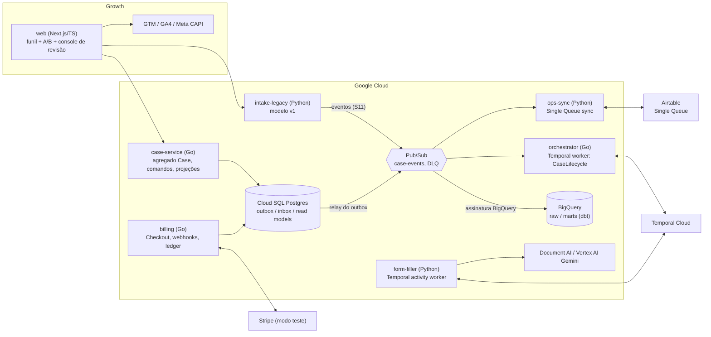

<!-- Arquivo gerado por scripts/gerar.py — edite scripts/plano/templates/C-projeto-portfolio.md. -->

# C) Projeto de portfólio integrador: LeaveFlow

**LeaveFlow** é um sistema de intake e gestão de casos de afastamento médico (no modelo do FMLA dos EUA), construído aos poucos
ao longo das 24 semanas, com **dados 100% fictícios**. Ele reproduz em escala menor a arquitetura da vaga: serviços Go e Python
no Cloud Run, Pub/Sub e Temporal, PostgreSQL com outbox/CQRS/projeções, bounded contexts, migração do legado lado a lado,
Stripe, Airtable bidirecional, extração de formulários com revisão humana, Next.js com A/B, CI/CD, observabilidade, BigQuery
e práticas estilo HIPAA.

Crie um repositório próprio `leaveflow` (monorepo). Este repositório (`road-to-success`) guarda só o plano.

## Princípios

1. **A solução confiável mais simples.** 6 serviços em vez dos ~9 da vaga; cada peça nova precisa de um ADR que diga por que
   ela existe e o que **não** será feito agora.
2. **Toda semana termina em demo + update escrito.** Um release em staging/prd sempre que houver mudança visível.
3. **Falhar com segurança.** Cada design doc lista os modos de falha e o comportamento seguro de cada etapa.
4. **Dados fictícios e disciplina de PHI desde o dia 1.** Logs só com IDs; nada de dados reais.
5. **Trabalho AI-native verificável.** Regras no repositório, guardrails e registro do que os agentes erraram ([item D](D-fluxo-ai-native.md)).

## Arquitetura alvo (semana 24)



## Serviços e bounded contexts

| Serviço | Linguagem | Bounded context | Responsabilidade | Semanas |
|---|---|---|---|---|
| `intake-legacy` | Python (FastAPI) | Intake (legado) | Modelo v1 propositalmente simples (tabela única, status livre); passa a emitir eventos na migração | 3, 11 |
| `case-service` | Go | Case Management | Agregado `Case` (máquina de estados), comandos, outbox, projeções (`case_summary`, `ops_queue_view`) | 4, 7-11 |
| `orchestrator` | Go | Processo do caso | `CaseLifecycle` no Temporal: sinais, timers de SLA, saga com compensações, versionamento | 9-10, 12, 16-17 |
| `billing` | Go | Billing | Checkout, webhooks com inbox, assinaturas, upsell, ledger e reconciliação | 12-13, 22 |
| `ops-sync` | Python | Ops Queue | Projeção para a Single Queue, entrada de mudanças de Ops, replay seguro, reconciliação | 14-15 |
| `form-filler` | Python | Clinical Documentation | Extração (Document AI e/ou Gemini), validação, evals, revisão humana, PDF final | 16-17 |
| `web` | TypeScript (Next.js) | Growth + console de staff | Funil, experimento A/B, tracking, console de revisão | 17, 21-22 |
| `analytics` | SQL (dbt) | Analytics | Eventos crus → marts, testes de qualidade, dashboard | 19, 22 |
| `infra` | YAML/gcloud/Terraform | — | Cloud Build, Pub/Sub, Cloud Run, segredos, alertas | 5, 8, 18, 20 |

Scheduling (Healthie-like) e assinatura de documentos (PandaDoc-like) entram como **adapters por interface com fakes**; a
integração real é opcional (semanas 17 e 22).

## Eventos de domínio (versionados em `schemas/events/`)

| Evento | Produtor | Consumidores |
|---|---|---|
| `CaseOpened` | case-service (e intake-legacy após a S11) | orchestrator, ops-sync, BigQuery |
| `PaymentConfirmed` / `PaymentRefunded` | billing | orchestrator (sinal), ops-sync, BigQuery |
| `ConsultScheduled` / `ConsultCancelled` | orchestrator (adapter de agendamento) | case-service, ops-sync |
| `DocumentExtracted` / `ReviewCompleted` | form-filler / console | orchestrator, ops-sync |
| `CertificationDrafted` / `CertificationSigned` | form-filler / adapter de assinatura | case-service, ops-sync |
| `OpsFieldChanged` | ops-sync (vindo do Airtable) | case-service (vira comando) |
| `CaseClosed` | case-service | ops-sync, BigQuery |

## Desenhos que o projeto precisa provar

**Idempotência em todas as bordas.** `Idempotency-Key` persistida nas APIs de escrita; inbox com `event_id` único para
webhooks e mensagens; chaves de idempotência derivadas (ex.: `workflowId + activityId`) em chamadas externas.

**Outbox + Pub/Sub.** Evento gravado na mesma transação do agregado; relay com `SELECT ... FOR UPDATE SKIP LOCKED`,
ordering key = `case_id`; consumidores idempotentes; DLQ com CLI de reprocessamento.

**Saga no Temporal.** Pagamento → agendamento → documentação → assinatura → encerramento, com compensações LIFO
(cancelar consulta, estornar) testadas passo a passo, replay tests e versionamento de workflows em execução.

**Migração lado a lado (semana 11).** Legado passa a emitir eventos; camada anticorrupção traduz para o modelo novo;
backfill idempotente com checkpoint; shadow read com relatório de paridade; leituras roteadas por feature flag
(10% → 50% → 100%) com rollback instantâneo; runbook ensaiado. Dual-write evitado de propósito (justificar no ADR).

**Airtable bidirecional (semanas 14-15).** Propriedade por campo:

| Campos do backend (projeção escreve) | Campos de Ops (projeção **nunca** escreve) |
|---|---|
| `case_id`, `status`, `payment_status`, `consult_at`, `documents` (anexos), `sla_due_at` | `ops_status`, `assignee`, `ops_notes`, `callback_at`, `exception_reason` |

Saída: eventos → upsert por `case_id` em lotes de 10, token bucket de 5 req/s por base, espera de 30 s em 429, anexos
idempotentes (hash). Entrada: automação do Airtable ("Run a script") chama o ops-sync com HMAC + timestamp; o ops-sync
valida e emite comando. Replay: CLI por caso/intervalo com dry-run e diff, que respeita a propriedade por campo e detecta
conflito por versão. Recuperação: DLQ + runbook caso a caso + reconciliação diária Airtable × banco. Mapeamento em YAML com
validação estrita e testes de contrato (um campo errado quebra o build).

**Stripe (semanas 12-13).** Checkout (avaliação avulsa + assinatura de acompanhamento), webhook com verificação de
assinatura no corpo cru, inbox, busca do estado atual do objeto (não confiar na ordem), estorno como compensação, ciclo de
assinatura com test clocks, portal do cliente, upsell, ledger interno e reconciliação diária com discrepâncias plantadas.

**AI Form Filler (semanas 16-17).** 30 documentos sintéticos + formulário público WH-380-E como alvo; extração A (Document
AI Form Parser) × B (Gemini com schema) × híbrido; validação; evals por campo (precisão/recall, % documentos 100% corretos,
custo, latência); revisão humana quando a confiança fica abaixo do limiar; correções viram dados de análise de erros; o eval
é gate no CI. Saída: documento "onde falhou, o que aprendi, como melhorei" (o diferencial da vaga).

**Práticas estilo HIPAA (semana 3 em diante, consolidadas na 20).** Classificação de dados, mínimo necessário, logs e traces
sem PHI, RBAC no console, trilha de auditoria imutável de acesso a casos, Cloud Audit Logs, segredos no Secret Manager com
rotação, retenção/expurgo, pseudonimização no BigQuery, threat model, revisão OWASP API Top 10, guardrails de agentes para
dados sensíveis.

**Observabilidade (semanas 5 e 18).** Logs JSON com trace id, OpenTelemetry (HTTP + Pub/Sub + Temporal) no Cloud Trace,
métricas de negócio (lag do outbox, DLQ, 429, compensações, falhas de extração), SLOs com alertas por burn rate e runbook
por alerta.

## Estrutura sugerida do repositório `leaveflow`

```
leaveflow/
├── AGENTS.md / CLAUDE.md         regras para agentes (item D)
├── .claude/                      settings.json (permissões), hooks, subagentes
├── services/
│   ├── intake-legacy/  (Python)  ├── case-service/ (Go)   ├── orchestrator/ (Go)
│   ├── billing/        (Go)      ├── ops-sync/  (Python)  └── form-filler/  (Python)
├── web/                (Next.js)
├── analytics/          (dbt)
├── schemas/events/     (JSON Schema versionado)
├── infra/              (cloudbuild.yaml, gcloud/Terraform, alertas)
├── datasets/           (documentos sintéticos + rótulos)
└── docs/
    ├── design-docs/  adr/  runbooks/  postmortems/  checkpoints/
    ├── updates/      (updates diários e semanais)
    ├── agent-reviews.md
    └── avaliacao-de-lacunas.md
```

## Definição de pronto (vale para todo marco)

- Testes verdes no CI (incluindo testes de arquitetura e, a partir da semana 16, evals).
- Deploy em staging; em produção quando o marco diz "release".
- Docs atualizados (design doc/ADR/runbook do marco) e update escrito.
- Demo gravada (1-3 min) e linha do cronograma marcada como "Feito".
- Nenhum segredo nem dado pessoal real no repositório.

## Marcos semanais

| Semana | Tema | Marco do projeto | Critério de pronto | Artefatos de liderança |
|---|---|---|---|---|
| 1 | Diagnóstico I + setup do ambiente | Repositório 'leaveflow' criado (monorepo vazio com docs/), projeto GCP com alertas de orçamento. | 17 exercícios de diagnóstico feitos e registrados na aba Diagnóstico; plano ajustado v1 escrito. | Revisão de PR (D13), design doc de 1 página (D14), plano ajustado v1. |
| 2 | Diagnóstico complementar + fundamentos personalizados | Design doc #1 do LeaveFlow, glossário e context map preliminar. | Badge de Cloud Run iniciado/concluído, design doc #1 revisado, registro de riscos v0. | Design doc #1, registro de riscos, plano de comunicação. |
| 3 | Serviço 'legado' em Python + modelagem v1 + dados fictícios | intake-legacy (FastAPI + Postgres) com testes, rodando em Docker. | POST/GET de casos, migrações, seeds fictícios, cobertura ≥70%, logs sem PHI, docker compose up funcionando. | Design doc #2 (por que o legado é assim), retro + update semanal. |
| 4 | Go essencial + endpoint idempotente persistido + Checkpoint 1 | case-service v0 (Go) com POST idempotente persistido e GET paginado. | go test -race verde com 50 requisições concorrentes; ADR-001; demo de 3 min gravada. | ADR-001, checkpoint 1 (matriz + replanejamento). |
| 5 | CI/CD, Cloud Run, Cloud SQL, staging e produção | Pipeline Cloud Build: lint → testes → build → deploy staging; prd por tag com aprovação. | Release v0.1.0 em prd; rollback testado; ADR-002 (topologia); custo diário anotado. | ADR-002, runbook de release, update + registro de riscos. |
| 6 | APIs, webhooks e kit de integração + TypeScript | Kit de integração (Go e Python) + receptor de webhooks genérico + cliente TS gerado do OpenAPI. | Teste de caos com provedor fake (30% erros/429) sem efeitos duplicados; PR do júnior revisado. | Design doc #3 (padrão de integração), revisão de PR do júnior #1. |
| 7 | DDD estratégico/tático + Clean Architecture + testes de arquitetura | case-service reorganizado (domain/app/adapters) com agregado Case e eventos de domínio. | Context map + Bounded Context Canvas; testes de arquitetura quebrando o build em violação. | ADR-003 (limites e o que NÃO separar), 1:1 simulado com o júnior. |
| 8 | Transactional outbox + Pub/Sub + consumidores idempotentes + Checkpoint 2 | Outbox + relay (SKIP LOCKED) → Pub/Sub; consumidor idempotente; DLQ com CLI de reprocessamento. | Teste prova atomicidade (rollback não publica); poison message vai para DLQ; checkpoint 2 feito. | Postmortem simulado #1, checkpoint 2 com comunicação de risco. |
| 9 | Temporal: fundamentos e workflow CaseLifecycle v1 | orchestrator (Go) com CaseLifecycle v1 + ponte Pub/Sub → sinal; worker Python esqueleto. | Temporal 101/102 concluídos; testes de workflow e replay passando. | Design doc #4 (CaseLifecycle), plano quinzenal com trade-offs. |
| 10 | Sagas, CQRS e projeções; versionamento de workflows | Saga com compensações; projeções case_summary e ops_queue_view com rebuild; versionamento aplicado. | Teste de falha em cada passo da saga; rebuild = estado incremental; replay antes/depois do patch. | ADR-004 (CQRS onde paga), mensagem de desbloqueio ao júnior. |
| 11 | Migração do modelo legado para o novo, lado a lado | Legado emitindo eventos; backfill idempotente; comparador de paridade; roteamento por feature flag. | 100% em staging e 10% em prd com paridade ≥99% nos campos críticos; runbook de cutover/rollback ensaiado. | Plano de iniciativa grande (formato 60 dias), premortem, status report para stakeholders. |
| 12 | Stripe I: checkout, webhooks e PaymentConfirmed + Checkpoint 3 | billing (Go): Checkout Session, webhook assinado com inbox, PaymentConfirmed → saga. | Webhook duplicado não duplica efeito; evento fora de ordem tratado; estorno de teste na saga; checkpoint 3. | Design doc #5 (pagamentos e modos de falha), checkpoint 3. |
| 13 | Stripe II: assinaturas, dunning, portal, upsell e reconciliação | Ciclo de assinatura com test clocks, portal do cliente, add-on de upsell, job de reconciliação. | 3 discrepâncias plantadas detectadas e corrigidas; release v0.4 com pagamentos/assinaturas. | Runbook de discrepância, resposta ao pedido do Head of Growth. |
| 14 | Airtable I: observar Ops, Single Queue e projeção de saída | Base Single Queue + ops-sync (Python) projetando eventos com rate limit, validação e anexos. | Caso aparece na Single Queue com anexo em <1 min; burst de 200 casos respeita 5 req/s; mapeamento validado no CI. | Mapa as-is + job stories, ADR-005, mensagem de alinhamento com Ops. |
| 15 | Airtable II: mudanças de Ops, replays seguros e recuperação | Entrada via automação → endpoint assinado; propriedade por campo; CLI de replay; reconciliação diária. | Teste de edição concorrente passa; game day recuperado; release v0.5 com métrica antes/depois. | Runbook de recuperação, postmortem do game day com 3 correções sistêmicas. |
| 16 | AI Form Filler I: extração, evals e privacidade + Checkpoint 4 | form-filler (Python): extração A (Document AI) e B (Gemini) + harness de evals + activity no workflow. | Métricas por campo publicadas; fallback para revisão humana abaixo do limiar; checkpoint 4. | ADR-006, brief de delegação do Form Filler ao júnior, checkpoint 4. |
| 17 | AI Form Filler II: human-in-the-loop e melhoria contínua | Fila de revisão (workflow + console Next.js), análise de erros, PDF preenchido, trilha de auditoria. | Métrica do eval melhora após ajustes (antes/depois documentado); e2e completo verde; release v0.6. | Doc 'onde falhou, o que aprendi', revisão de PR do júnior #3. |
| 18 | Observabilidade de ponta a ponta e SLOs | Tracing distribuído (HTTP + Pub/Sub + Temporal), SLOs com alertas de burn rate, dashboards, teste de carga. | Trace de um caso em 5 serviços; bug sutil achado só com logs/traces; relatório de capacidade. | Runbooks por alerta, relatório de confiabilidade. |
| 19 | Dados: BigQuery, dbt, qualidade e BI | Pub/Sub → BigQuery; dbt (staging → marts) com testes; dashboard Looker Studio; memo de decisão. | Testes de qualidade verdes no CI; incidente de dados plantado detectado e corrigido. | Contrato de dados, relatório para stakeholders. |
| 20 | Segurança e compliance estilo HIPAA + game day geral + Checkpoint 5 | Threat model, IAM mínimo, RBAC, trilha de auditoria, pseudonimização, guardrails de agentes para dados sensíveis. | Auditoria de acesso demonstrada; game day resolvido com postmortem; checkpoint 5. | Política de tratamento de dados, checklist de PR de dados sensíveis, postmortem. |
| 21 | Growth I: funil Next.js, experimento A/B e tracking | web/: intake multi-etapas, página de preço com A/B, dataLayer → GTM → GA4, conversões server-side. | Eventos no GA4 DebugView; purchase server-side deduplicado; variantes estáveis. | Brief do experimento com Growth, alinhamento sobre limites de atribuição. |
| 22 | Growth II: análise do experimento, upsell e full stack | Análise do experimento (SRM, IC), experimento de upsell, e2e Playwright, adapter Healthie/Cognito. | Memo de decisão publicado; release v0.8 de Growth. | Relatório do experimento, priorização de pedidos conflitantes Growth × Ops. |
| 23 | Avaliação de lacunas, correções sistêmicas e narrativa do sistema | Avaliação de lacunas + 3 correções sistêmicas + doc/vídeo 'como um caso flui' + portfólio. | Avaliação publicada; 3 correções em prd; walkthrough de 5 min; README de portfólio. | Avaliação de lacunas, onboarding doc, retrospectiva. |
| 24 | Prontidão para candidatura + Checkpoint 6 | LeaveFlow v1.0 com tag, custos desligados, portfólio publicado. | 7 respostas finais, vídeo Q5 ≤3 min, 3+ mocks feitos, 3-5 candidaturas piloto enviadas, checkpoint 6. | Plano 30-60-90 pessoal, checkpoint 6, análise de distância atualizada. |

## Artefatos de liderança acumulados

| Tipo | Quando |
|---|---|
| Design docs 001-006 (LeaveFlow, legado, integrações, CaseLifecycle, migração, pagamentos) | Semanas 2, 3, 6, 9, 11, 12 |
| ADRs 001-006 (idempotência, topologia GCP, bounded contexts, CQRS, sync Airtable, extração) + ADRs curtas | Semanas 4, 5, 7, 10, 14, 16 |
| Postmortems blameless 001-003 | Semanas 8, 15, 20 |
| Runbooks (release, cutover, discrepância de pagamento, recuperação Airtable, por alerta) | Semanas 5, 11, 13, 15, 18 |
| Updates diários (inglês) e semanais | Todos os dias / todo sábado |
| Status report da iniciativa + plano formato 60 dias + premortem | Semana 11 |
| Briefs de delegação, roteiros de 1:1, revisões de PR do júnior | Semanas 6, 7, 10, 16, 17 |
| Avaliação de lacunas no formato da vaga + 3 correções sistêmicas | Semana 23 |
| Onboarding doc, propostas não pedidas, retrospectiva final | Semana 23 |
