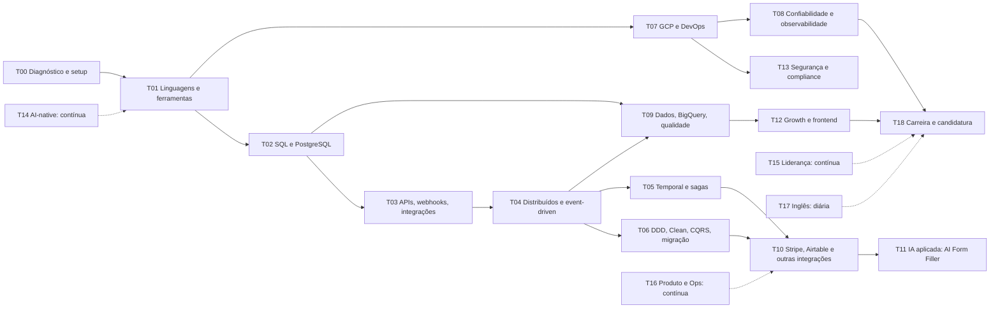

# A) Mapa de tópicos em trilhas

Todos os tópicos das seções 3 e 4 foram agrupados em {{N_TRILHAS}} trilhas de estudo, ordenadas por dependência
(fundamentos antes de padrões avançados). Cada tópico aponta para a sua trilha na [matriz de cobertura](matriz-de-cobertura.md).

## Ordem de dependência

As trilhas T14 (AI-native), T15 (liderança), T16 (produto/Ops) e T17 (inglês) correm em paralelo durante as 24 semanas.

## Trilhas

{{TABELA_TRILHAS}}

## Onde cada grupo do pedido caiu

| Grupo (seção 4) | Trilhas principais |
|---|---|
| Linguagens e ferramentas | T01 (Go, Python, TypeScript, Git/GitHub), T02 (SQL), T15 (Agile) |
| Dados | T02 (PostgreSQL, modelagem, sistemas de banco), T09 (BigQuery, analytics, BI, qualidade, Snowflake) |
| Engenharia e arquitetura | T04, T06 (design de sistema, DDD, distribuídos), T03/T10 (integrações), T07 (SDLC), T11 (IA), T15 (fase de engenharia, engenharia de projetos) |
| Cloud, DevOps e operação | T07 (nuvem, serverless, CD, implantação), T08 (manutenção, suporte, monitoramento) |
| Confiabilidade e qualidade | T08 (testes, QA, falhas, defeitos), T15 (feedback sobre código) |
| Compliance | T13 |
| Operações e negócio | T16 (fluxo de Ops, processos, excelência operacional, startup), T15 (planejamento estratégico, decisão, riscos) |
| Liderança | T15 |
| Gestão de projetos e comunicação | T15 |
| Idioma | T17 |

| Bloco (seção 3) | Trilhas principais |
|---|---|
| Natureza do cargo | T01, T15, T11, T12, T16 |
| Backend Systems & Reliability | T03, T04, T05, T06, T07, T08, T09, T10 |
| Operations Systems (Airtable) | T10, T16 |
| Growth Enablement | T12, T09 |
| Engineering Leadership | T15 |
| AI-Native Engineering | T14 |
| Expectativas 30-60-90 | T15, T08, T06, T14 (simuladas no projeto: ver a coluna "Semanas" da matriz) |
| Requisitos e diferenciais | Todas; lacunas que estudo não fecha estão no [item H](H-analise-de-distancia.md) |
| Cultura e condições | T15, T16, T17, T18 |
| Stack | T01, T02, T05, T07, T09, T10, T11, T12, T14 |
| Perguntas da candidatura | T17 (prática oral semanal) e T18 (versão final) |
